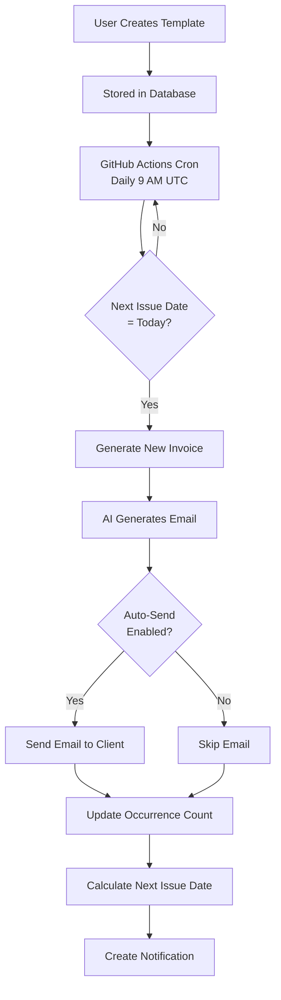

# 🚀 Quick Start Guide - Recurring Invoices & Budget Monitoring

## ⚡ TL;DR

### What Was Built:
1. **Recurring Invoice Automation** - Auto-generate and send invoices on schedule
2. **Budget Monitoring (Scope Sentinel)** - Track project budgets with AI alerts
3. **Dashboard Widgets** - Real-time overview of both features

### Key Routes:
- `/dashboard/invoices/recurring` - List all recurring invoices
- `/dashboard/invoices/recurring/new` - Create new recurring invoice
- `/dashboard` - Main dashboard with widgets

---

## 🎯 Quick Setup (5 minutes)

### 1. Add GitHub Secrets
Go to your GitHub repo → Settings → Secrets and variables → Actions → New repository secret

```bash
# Secret 1: CRON_SECRET
# Generate with: openssl rand -hex 32
Name: CRON_SECRET
Value: [paste generated token]

# Secret 2: APP_URL
Name: APP_URL
Value: https://your-production-url.com
```

### 2. Test Locally
```bash
cd /home/chemicalmyth/Desktop/Nesternity/nesternity

# Start dev server
pnpm dev

# Open in browser
http://localhost:3000/dashboard/invoices/recurring/new
```

### 3. Create Your First Recurring Invoice
1. Navigate to `/dashboard/invoices/recurring/new`
2. Select a client
3. Add invoice items (e.g., "Monthly Retainer", qty: 1, rate: 1000)
4. Choose "Monthly" recurrence
5. Set day of month (e.g., 1 for first of month)
6. Toggle "Auto-Generate" ON
7. Toggle "Auto-Send Email" ON (optional)
8. Click "Create Recurring Invoice"

### 4. Test Budget Monitoring
1. Go to `/dashboard`
2. Find the "Budget Monitor" widget
3. Click "Re-check" button
4. Widget will show current budget status
5. If overrun detected, click "Alert Client" to preview AI email

---

## 📋 Component Usage Examples

### RecurringInvoiceForm
```tsx
import RecurringInvoiceForm from "@/components/invoices/RecurringInvoiceForm";

// In your page component
const clients = await prisma.client.findMany({
  where: { createdById: userId },
});

return <RecurringInvoiceForm clients={clients} userId={userId} />;
```

### RecurringInvoiceCard
```tsx
import RecurringInvoiceCard from "@/components/invoices/RecurringInvoiceCard";

const invoices = await prisma.invoice.findMany({
  where: { isRecurring: true },
  include: { client: true, items: true },
});

return (
  <div className="grid gap-4 md:grid-cols-3">
    {invoices.map(invoice => (
      <RecurringInvoiceCard 
        key={invoice.id} 
        invoice={invoice}
        onUpdate={() => router.refresh()}
      />
    ))}
  </div>
);
```

### ScopeRadarWidget
```tsx
import ScopeRadarWidget from "@/components/dashboard/ScopeRadarWidget";

// In your dashboard
<ScopeRadarWidget
  clientId="client_id_here"
  userId={session.user.id}
  projectId="project_id_here" // optional
  compact={false}
/>
```

### RecurringInvoicesOverview
```tsx
import RecurringInvoicesOverview from "@/components/dashboard/RecurringInvoicesOverview";

const recurringInvoices = await prisma.invoice.findMany({
  where: { isRecurring: true, issuedById: userId },
  include: { client: true, items: true },
});

return <RecurringInvoicesOverview invoices={recurringInvoices} />;
```

---

## 🔄 Automation Flow

### How Recurring Invoices Work:



### Manual Trigger:
Go to GitHub repo → Actions → "Process Recurring Invoices" → Run workflow

---

## 📊 API Endpoints Reference

### Recurring Invoices

**Create Template**
```bash
POST /api/invoices/recurring/create
Content-Type: application/json

{
  "clientId": "client_id",
  "recurrence": "MONTHLY",
  "items": [
    {
      "description": "Monthly Service",
      "quantity": 1,
      "rate": 1000,
      "total": 1000
    }
  ],
  "taxRate": 18,
  "discount": 0,
  "currency": "USD",
  "autoGenerateEnabled": true,
  "autoSendEnabled": true,
  "sendDayOfPeriod": 1,
  "recipientEmails": ["cc@example.com"],
  "maxOccurrences": 12
}
```

**Process Invoice (Generate Now)**
```bash
POST /api/invoices/recurring/[id]/process
```

**Toggle Automation**
```bash
PATCH /api/invoices/recurring/[id]/toggle-automation
Content-Type: application/json

{
  "autoSendEnabled": true,
  "sendDayOfPeriod": 15,
  "recipientEmails": ["new@example.com"]
}
```

### Budget Monitoring

**Check Budget**
```bash
POST /api/ai/scope-sentinel/budget-check
Content-Type: application/json

{
  "clientId": "client_id",
  "projectId": "project_id" // optional
}
```

**Get Budget Status**
```bash
GET /api/ai/scope-sentinel/budget-check?clientId=client_id&projectId=project_id
```

---

## 🎨 Styling & Customization

### Color Scheme
```tsx
// Risk Levels
const colors = {
  safe: "green-600",      // < 80% budget
  warning: "yellow-600",  // 80-100% budget
  critical: "red-600",    // > 100% budget
};

// Recurrence Urgency
const urgency = {
  overdue: "red-600",
  thisWeek: "yellow-600",
  later: "green-600",
};
```

### Custom Styles
All components use Tailwind CSS and shadcn/ui. Customize via:
1. `/src/styles/globals.css` - Global styles
2. `tailwind.config.ts` - Theme colors
3. Component-level `className` props

---

## 🧪 Testing Scenarios

### Test 1: Weekly Invoice
1. Create invoice with "WEEKLY" recurrence
2. Set day of week = 1 (Monday)
3. Enable auto-send
4. Wait for next Monday (or manually trigger)
5. Verify invoice generated and email sent

### Test 2: Budget Warning
1. Create client with budget = $10,000
2. Create invoices totaling $8,500 (85%)
3. Click "Re-check" on ScopeRadarWidget
4. Should show "WARNING" status in yellow
5. Click "Alert Client" to preview email

### Test 3: Budget Critical
1. Continue from Test 2
2. Create invoice for $2,000 (total = $10,500)
3. Click "Re-check"
4. Should show "CRITICAL" status in red
5. Email should mention overrun amount

### Test 4: Max Occurrences
1. Create invoice with maxOccurrences = 3
2. Manually generate 3 times
3. Occurrence counter should show "3/3"
4. Next attempt should fail (max reached)

### Test 5: Pause/Resume
1. Create active recurring invoice
2. Toggle "Auto-Generate" OFF
3. Wait for next due date
4. Verify invoice NOT generated
5. Toggle ON again
6. Verify generation resumes

---

## 🐛 Troubleshooting

### Issue: Cron not running
**Check:**
1. GitHub Actions enabled in repo settings
2. Secrets `CRON_SECRET` and `APP_URL` set correctly
3. Workflow file at `.github/workflows/recurring-invoices-cron.yml`
4. Check Actions tab for error logs

**Fix:**
```bash
# Manually trigger workflow
GitHub → Actions → "Process Recurring Invoices" → Run workflow
```

### Issue: Budget widget not loading
**Check:**
1. Client has budget set OR proposal exists
2. API endpoint responding: `/api/ai/scope-sentinel/budget-check`
3. Console for errors
4. Network tab for failed requests

**Fix:**
```tsx
// Add error boundary in component
{budgetData ? (
  <ScopeRadarWidget {...props} />
) : (
  <p>No budget data available</p>
)}
```

### Issue: Invoice not auto-generating
**Check:**
1. `autoGenerateEnabled` = true
2. `nextIssueDate` <= today
3. Not exceeded `maxOccurrences`
4. Cron job ran (check GitHub Actions logs)

**Fix:**
```sql
-- Check invoice status
SELECT id, invoiceNumber, nextIssueDate, autoGenerateEnabled, occurrenceCount, maxOccurrences
FROM "Invoice"
WHERE "isRecurring" = true;
```

### Issue: Email not sending
**Check:**
1. `autoSendEnabled` = true
2. Email service configured (Resend, SendGrid, etc.)
3. `recipientEmails` array populated
4. Check email provider logs

**Fix:**
```typescript
// In process endpoint, add email service integration
await resend.emails.send({
  from: 'billing@yourcompany.com',
  to: invoice.client.email,
  cc: invoice.recipientEmails,
  subject: `Invoice ${invoiceNumber}`,
  html: emailHtml,
});
```

---

## 📈 Performance Tips

### Optimize Dashboard Loading
```typescript
// Use React Query caching (already implemented)
staleTime: 5 * 60 * 1000, // 5 minutes
gcTime: 10 * 60 * 1000,   // 10 minutes
refetchOnWindowFocus: false,
```

### Reduce Database Queries
```typescript
// Use Prisma select to fetch only needed fields
select: {
  id: true,
  invoiceNumber: true,
  // ... only what you need
}
```

### Optimize Cron Job
```typescript
// Process invoices in batches
const batchSize = 10;
for (let i = 0; i < invoices.length; i += batchSize) {
  const batch = invoices.slice(i, i + batchSize);
  await Promise.all(batch.map(processInvoice));
}
```

---

## 🔐 Security Checklist

- [x] Cron endpoint protected with `CRON_SECRET`
- [x] User authentication via Clerk
- [x] API endpoints validate user ownership
- [x] Database queries scoped to user ID
- [x] Sensitive data not exposed in client components
- [x] Environment variables secured
- [x] GitHub secrets encrypted

---

## 📞 Support

### Documentation
- Full implementation: `/RECURRING_INVOICES_SCOPE_SENTINEL.md`
- UI components: `/UI_COMPONENTS_IMPLEMENTATION.md`
- This guide: `/QUICK_START_GUIDE.md`

### Logs
- GitHub Actions: Repo → Actions → Workflow runs
- Application: Browser console + Network tab
- Database: Prisma Studio (`npx prisma studio`)

---

## 🎉 Success Metrics

You'll know it's working when:
1. ✅ Recurring invoices appear in dashboard widget
2. ✅ GitHub Actions runs daily without errors
3. ✅ Invoices auto-generate on schedule
4. ✅ Budget widget shows color-coded status
5. ✅ Notifications created for all events
6. ✅ AI emails preview successfully
7. ✅ Users can manage templates easily

**Happy automating! 🚀**
